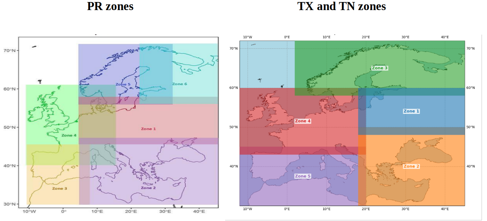

# Preprocess (PR) — README

## Motivation

Precipitation (PR) data in this project is organized in a different zoning scheme than the TN/TX variables: PR is provided in 6 zone pieces while TN and TX are provided in 5 zones. The downstream non-parametric SPEI processing and models expect a consistent 5-zone tiling (the same tiling used by TN/TX). Therefore we run a preprocessing step for PR which:

- reads the PR pieces (the 6 original PR zone files),
- stitches or slices them as required to produce the PR inputs matching the 5-zone layout used elsewhere,
- writes per-month/netCDF files in the expected folder structure that downstream steps (e.g. SPEI calculation and model inputs) will consume.





## Files in this folder: SLURM job submission wrapper.

You can view the folder on GitHub here: [preprocess/](https://github.com/cosminmarina/levante_npspei_tool/tree/master/preprocess)

- [sbatch_preprocess_pr.sh](https://github.com/cosminmarina/levante_npspei_tool/blob/master/preprocess/sbatch_preprocess_pr.sh)

  - A SLURM job submission script used to run `preprocess_pr_model.py` on your cluster.
  - It loads modules and activates the conda environment used by the original project, and then calls:
    ```
    python preprocess_pr_model.py -z 2
    ```

    by default (zone `2` in that script).
  - Edit this script to change the zone or other SLURM settings before submitting with `sbatch`.
- [preprocess_pr_model.py](https://github.com/cosminmarina/levante_npspei_tool/blob/master/preprocess/preprocess_pr_model.py)

  - The main preprocessor script. Usage:
    ```
    python preprocess_pr_model.py -z <zone>
    ```

    - `-z` / `--zone` is an integer indicating which target zone (in the 5-zone final layout) to produce.
  - The script:
    - defines months (`01_January` ... `12_December`),
    - loops ensembles (default `1..25`),
    - creates the output directories: `./data/zone{zone}/ens{ens:02d}/pr_model/{month}/`,
    - opens existing PR NetCDF files from the original files (paths hard-coded in the script),
    - for each zone performs zone-specific slicing/concatenation logic (stitching parts of multiple PR zone files to produce the final zone),
    - writes the result to:
      ```
      ./data/zone{zone}/ens{ens:02d}/pr_model/{month}/predict_training.nc
      ./data/zone{zone}/ens{ens:02d}/pr_model/{month}/predict_testing.nc
      ```
    - Important: the script contains zone-specific code paths (e.g. implementations for zone 1, 2, 5 in the current version). If you request an unsupported zone the script will print an error. Inspect `preprocess_pr_model.py` to confirm which zones are implemented and to adapt it to additional zones if needed.

## Environment and dependencies

- The existing `sbatch_preprocess_pr.sh` expects:
  - `module load cdo`
  - `module load pytorch`
  - a conda environment named `minu_80` (the script loaders `conda activate minu_80`)
- The Python script requires (at minimum):
  - Python 3
  - xarray
  - numpy
  - pathlib
  - argparse
- Make sure your Python environment has `xarray` and `numpy` installed and that you can access the input data paths referenced in the script.

## Input data paths

`preprocess_pr_model.py` uses absolute paths to the original PR files produced by the bias-correction/downscaling pipeline. Example pattern (as in the script):

```
/work/bb1478/Darrab/bias_correction/bc_medwsa/Pr/zone{N}/ens{ens:02d}/outputs/bc_medewsa_{c|v}al_pr_daily_{1993-2014|2015-2015}_{MM}.nc
```

- If you do not have access to these `/work/...` locations, modify the Python script to point to the correct location of your PR input files.
- The script expects both "training" and "testing" input sets. The `sets_data = ['training', 'testing']` variable controls this.

## Output structure

For each run the script creates:

- `./data/zone{zone}/ens{ens:02d}/pr_model/` and (also created but not populated here) `tn_model/`
- Under each ensemble, for each month:
  - `./data/zone{zone}/ens{ens:02d}/pr_model/{month}/predict_training.nc`
  - `./data/zone{zone}/ens{ens:02d}/pr_model/{month}/predict_testing.nc`

This layout mirrors the expected structure for downstream steps (SPEI calculator and model training).

## How to run

1. Run with SLURM (recommended on cluster)

   - Edit `sbatch_preprocess_pr.sh` and change the `python preprocess_pr_model.py -z 2` line to the zone you need (for example `-z 1` or `-z 3`).
   - Submit the job:
     ```
     sbatch sbatch_preprocess_pr.sh
     ```
   - Check the output log specified in the SLURM script (by default `out_sh_pr2.log`) for progress and errors.
2. Run interactively or on a login node (small tests)

   - Activate your conda environment (or virtualenv) with the required packages:
     ```
     conda activate [YOUR_ENV]
     ```
   - Run for a single zone:
     ```
     python preprocess_pr_model.py -z 2
     ```
   - Or run multiple zones in a loop (example: zones 1..5):
     ```
     for z in 1 2 3 4 5; do
         python preprocess_pr_model.py -z $z
     done
     ```
   - To limit ensembles or months for testing, edit `preprocess_pr_model.py` and temporarily change the `ensembles = range(1,26)` (or months list) to a smaller subset.

## Notes & troubleshooting

- Missing files / FileNotFoundError:

  - The script opens many absolute paths. If the script fails opening inputs, edit the file paths in `preprocess_pr_model.py` to match your storage layout, or copy required input files to the expected locations.
- Zone not implemented:

  - If you run with a zone number that the script does not implement, it will print an error message. Inspect the `if zone == ...` blocks in `preprocess_pr_model.py` and add logic for the missing zone(s) if needed.
- Performance:

  - The script loops all ensembles (1..25) and all months (12) and both training/testing sets; this can take significant time and disk space. For debugging, reduce `ensembles` and/or `sets_data`.
- Permissions:

  - Ensure the user running the script has read access to the input files and write access to the `./data/` output location.
- Logging:

  - The script prints simple progress lines (zone, ensemble). Consider adding more logging (e.g. Python `logging`) if you need detailed diagnostics.

## References

- The SLURM script `sbatch_preprocess_pr.sh` is a simple wrapper that loads modules and activates the conda env before calling the Python script.
- Inspect `preprocess_pr_model.py` to understand how each zone is constructed (the script contains zone-specific concatenation/slicing logic). Update the script if your zone definitions differ.
